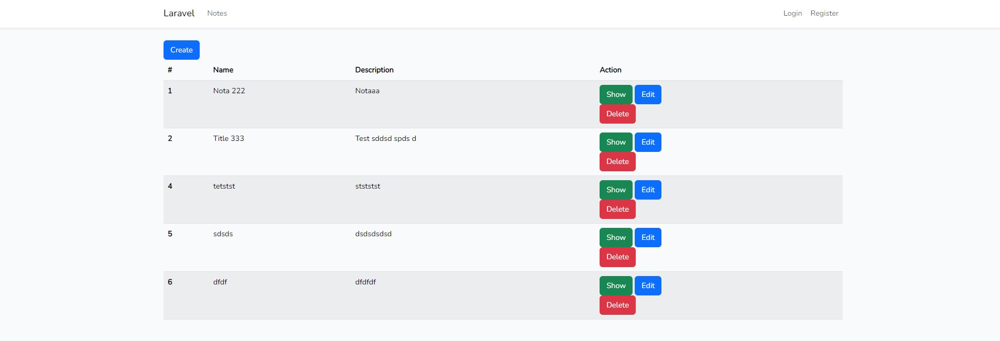

# Laravel 11 Bootstrap 5 Starter Kit Notes Crud
 Laravel 11 Bootstrap 5 Starter Kit Notes Crud

With this you will be able to:

- User register (Breeze)
- User login (Breeze)
- Recover password (Breeze)
- Post a new note (Basic CRUD)
- Edit a note (Basic CRUD)
- Delete a note (Basic CRUD)
- See a note (Basic CRUD)
- List notes (Basic CRUD)

It also includes verification messages. It also includes the verification and validation control messages on creation via NoteRequest, isolating the validation rules from the controller.
